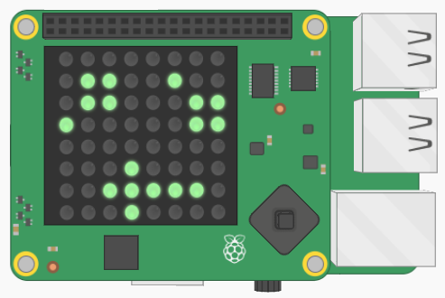

## Introduction

In this project, you will learn to display messages on the Raspberry Pi Sense HAT and use it's 8x8 LED grid to create pictures. Using these skills, you will create an animated "Reduce, Reuse, Recycle" sign to remind people to keep our planet clean!

### What you will make

--- no-print ---
Add instructions for using the embedded content here.

    <iframe src="https://trinket.io/embed/python/5d9b401d55?outputOnly=true&start=result" frameborder="0" marginwidth="0" marginheight="0" allowfullscreen>
    </iframe>

--- /no-print ---

--- print-only ---

--- /print-only ---

--- collapse ---
---
title: What you will need
---
### Hardware

+ Raspberry Pi with a Sense HAT (optional)

### Software

+ This project can be completed in a web browser using [trinket.io](https://trinket.io/)'s Sense HAT emulator.

### Downloads

+ [rpf.io/project-name-go](http://rpf.io/animated-signs-go){:target="_blank"}

--- /collapse ---

--- collapse ---
---
title: What you will learn
---

+ How to display text on the Raspberry Pi Sense HAT
+ How to create and display images on the Raspberry Pi Sense HAT
+ How to use a loop to repeat instructions forever

--- /collapse ---

--- collapse ---
---
title: Additional information for educators
---

If you need to print this project, please use the [printer-friendly version](https://projects.raspberrypi.org/en/projects/animated-signs/print){:target="_blank"}.

[Here is a link to the resources for this project](http://rpf.io/animated-signs-go).

--- /collapse ---
